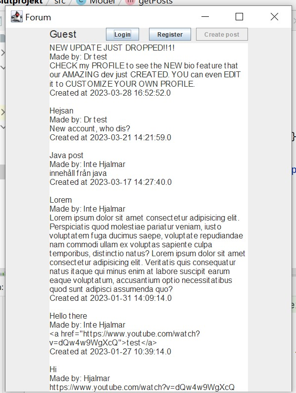

# Planering
GUI ritat ut i [Figma](https://www.figma.com/file/pUN0oFfNOED2i6mp0Zh7OZ/prg2-slutprojekt?node-id=0%3A1&t=55ccjZPlMn5sCcDZ-1)

## Tidsplanering

|   | Torsdag  | Fredag  |
|---|---|---|
| v17  | Komma på ide, planering  | planering, figma, refakturisering  |
| v18  | refakturisering, kodning  | Kodning  |
| v19  | ^  | ^  |
| v20  | -  | -  |
| v21  | ^  | Bli klar kodmässigt  |
| v22  | skriva PM  | visa upp  |

## Loggbok

27/4: Planerat ut min ide, skapat och fyllt i drawio, 

28/4: Skissat i Figma, uppdaterat drawio, börjat sätta upp projektet och skapa kod, 

4/5: Skapat MVC, gjort en prototyp layout i view där knappar inte fungerar än, kopplat upp MVC så view syns,
 skapad kod i Model för att koppla upp till databas och sedan visa raderna där ifrån i formen av klassen Post.

5/5: Idag har jag skapat 'under'-fönster som aktiveras av knappar, börjat på login() metod och 
ändrat utseende lite för hur posts syns. 

11/5: Skrev klart(?) login() metod men får error av hur lösenorden i databasen är krypterade. 
Därför började jag med register() metod för att skapa konto genom detta Java forum och logga in på dem. 

12/5: Inget internet. Jobbade på och skapade grund för att skapa post i forumet men programmet går 
inte att köra eller testa idag. Små ändringar över hela projektet. 