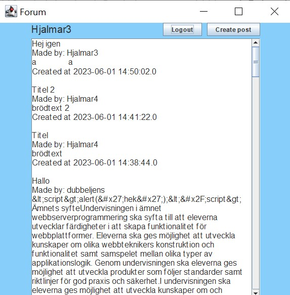

# Planering
GUI ritat ut i [Figma](https://www.figma.com/file/pUN0oFfNOED2i6mp0Zh7OZ/prg2-slutprojekt?node-id=0%3A1&t=55ccjZPlMn5sCcDZ-1)

[ReadMe.md](../ReadMe.md) | [PM.md](./PM.md) 

## Tidsplanering

|   | Torsdag  | Fredag  |
|---|---|---|
| v17  | Komma på ide, planering  | planering, figma, refakturisering  |
| v18  | refakturisering, kodning  | Kodning  |
| v19  | ^  | ^  |
| v20  | -  | -  |
| v21  | ^  | Bli klar kodmässigt  |
| v22  | börja skriva PM, artifact?, göra klart  | PM |
| v23  | visa upp  | -  |

## Loggbok

27/4: Planerat ut min ide, skapat och fyllt i drawio, 

28/4: Skissat i Figma, uppdaterat drawio, börjat sätta upp projektet och skapa kod, 

4/5: Skapat MVC, gjort en prototyp layout i view där knappar inte fungerar än, kopplat upp MVC så view syns,
 skapad kod i Model för att koppla upp till databas och sedan visa raderna där ifrån i formen av klassen Post.


5/5: Idag har jag skapat 'under'-fönster som aktiveras av knappar, börjat på login() metod och 
ändrat utseende lite för hur posts syns. 

11/5: Skrev klart(?) login() metod men får error av hur lösenorden i databasen är krypterade. 
Därför började jag med register() metod för att skapa konto genom detta Java forum och logga in på dem. 

12/5: Inget internet. Jobbade på och skapade grund för att skapa post i forumet men programmet går 
inte att köra eller testa idag. Små ändringar över hela projektet. 

~22/5: Fixade dumheter efter att ha vilat upp hjärnan under långhelgen, som ```stmt.executeUpdate()``` istället för ```stmt.executeQuery()``` 
INSERT-queries, allmänna ställen där jag har skrivit fel i SQL-queries, med mera. 
Att skapa konto samt logga in fungerar nu som det ska. [Relevant meme](./images/meme.png)

25/5: Skapade och gjorde klart knappar för att skapa en post och för att logga ut. Nästa lektion ska jag 
ge ut error i View för när användaren inte kan logga in och sådant. 
Funderar också på att ändra färger och att färgkoda de olika fönstrarna. 

26/5: Idag har jag fixat så att en error ruta kommer upp när användaren exempelvis misslyckas med att logga in. 
Jag ändrade också färgerna på bakgrunderna av de olika fönstrena i hopp om att kunna färg-koordinera olika 
fönster för att lättare se vilket som är vilket, och nu ser det ganske okej ut i alla fall. 
Sedan bestämde jag att jag vill kunna aktivera knappar genom tangentbordet så jag la in ```KeyListeners```
för ```Send / Login / Register account``` med Enter-knappen. Det fungera inte helt som jag vill pga att 
```KeyListener```:en inte lyssnar när en textruta är i användning utan man måste tabba ut ur den. 
Jag la också in en ```MouseListener``` för att skapa en ```hover``` effekt på logga ut knappen. 
Anledningen till att det är på bara en knapp är att den knappen har ingen melLanhand som en popup eller liknande, 
utan det är bara en direkt logout. ```Hover```:en är till för att byta färg på knappen när man har 
muspekaren över den.


1/6: Jag har lagt till några fler KeyListeners för att navigera huvudmenyn(knapparna i toppen) med tabb och enter. 
Samt testade jag olika saker för att få startsidan att se bättre ut men det mesta av det tog jag bort efter då det inte fungerade. 
Jag började också skriva PM. 
